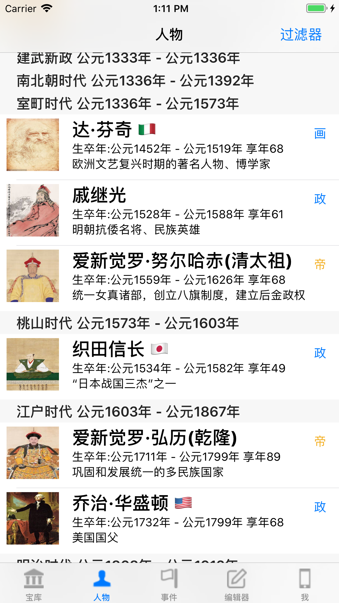
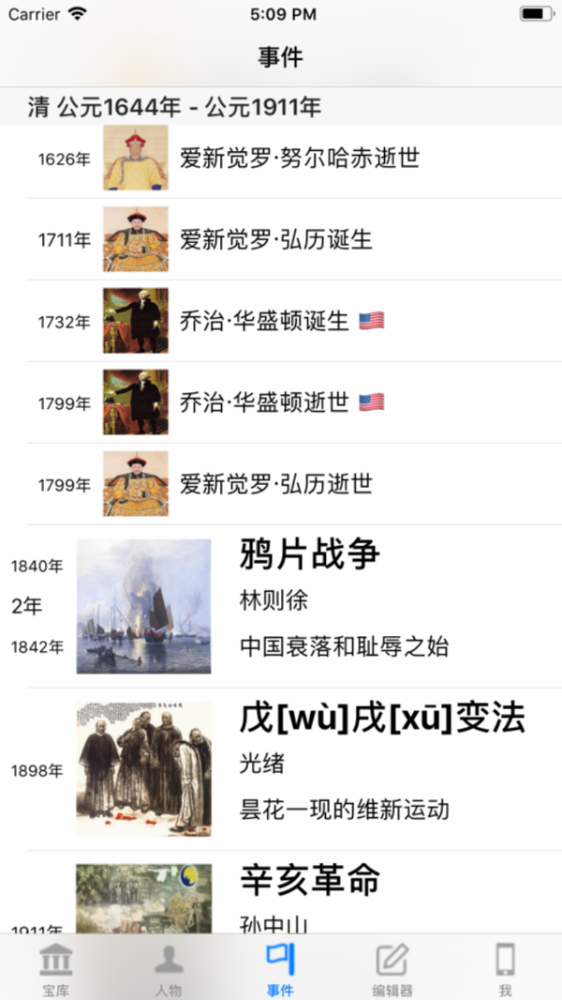
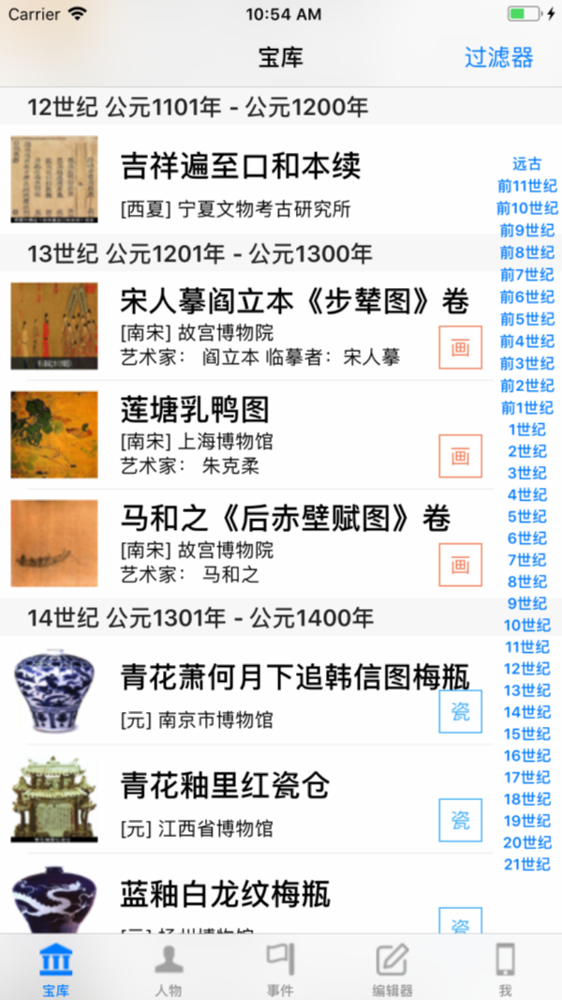
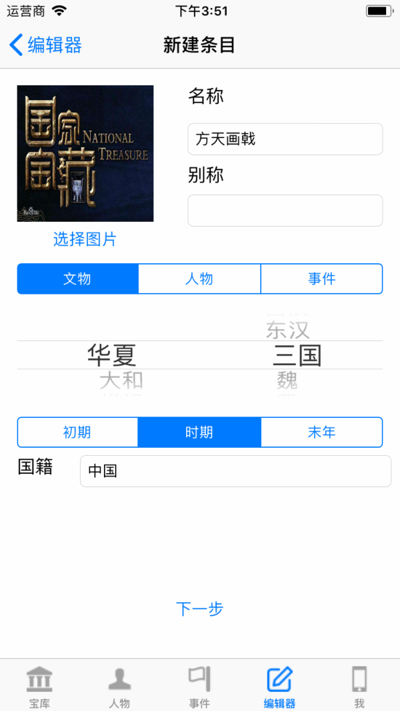
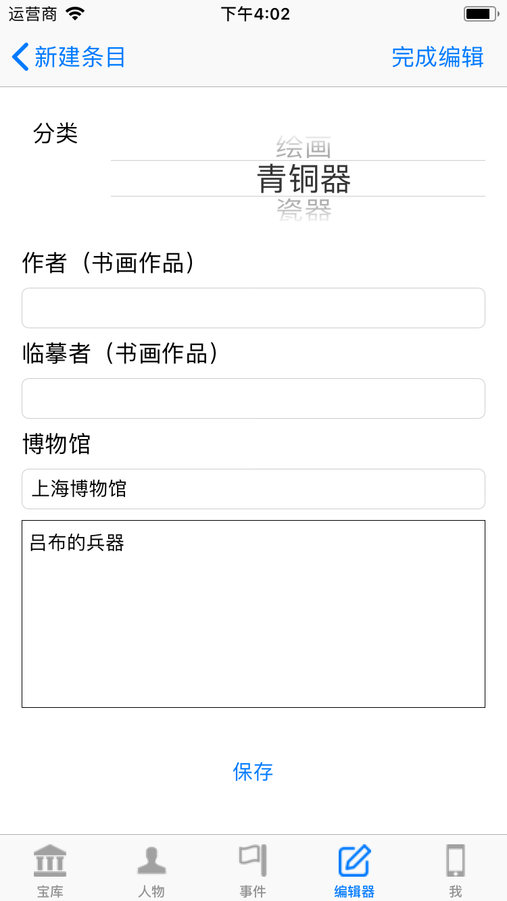
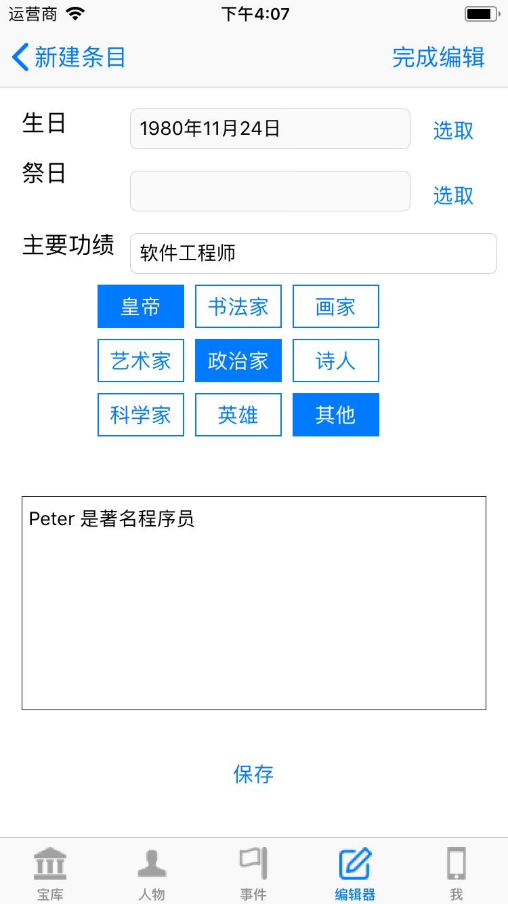
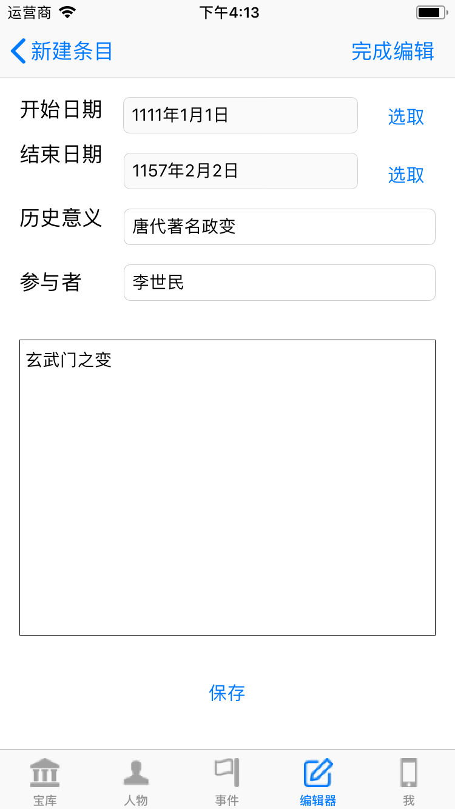

# 口袋历史书

## 版本号：Ver1.0.0

### 暴力小灰兔 2018年5月21日

## 这里是该App的技术支持网站

如果你有任何问题，可以在这里提你的Issue（拥有github账号的开发者）

如果是一般用户，你可以发送邮件到 mynightelfplayer@hotmail.com , 所有的邮件都会在第一时间获得回复。

请在邮件标题处注明 [口袋历史书] 字样。你可以将你的意见或者建议，或者期待功能写在邮件里面。

本项目的源代码将被托管于此，您可以以共享源代码，提供资料，纠正错误等方式贡献您的力量。

源代码将在AppStore审核通过之后开源。（如果AppStore的政策允许开源的话）

## 项目信息

- 开发工具 XCode9.3 Swift4.1开发。
- 目标iOS版本 iOS10.1及其以上
- iPhone5s及其以上（暂时不支持iPad，推荐使用iPhone6以上大屏手机）
- CoreData相关：CoreData暂时只用来保存用户自定义数据
- 3rdParty：暂时没有使用任何WebAPI和第三方库

## 版权申明

该项目所有的资源（文物，任务，事件的图片，描述等）来源于网络收集，如果有侵犯版权的问题，可以写邮件给我，我一定会及时处理的。

请不要使用本项目的源代码包装成app(无论是免费还是收费)，本人拥有代码的版权。

如果是学生毕业设计需要，或者求职需要，且对于项目有较大的贡献，可以使用本项目作为展示用。

## 用户手册

### 开发初衷

希望通过本App能够帮助您更好的了解我国悠久的历史，灿烂的文化，精美的国宝。

激发大家的民族自豪感和民族自尊心，为中华民族的伟大复兴，不忘使命，努力奋斗，砥砺前行。

### 展示篇

本app分为文物，任务，历史三个维度来展示中国文化。
同时为了能够和世界史进行对比，也增加了一些世界性的条目。
这些条目旨在帮助用户了解在相同的时代，世界发生了什么。

- 文物：通过对文物的历史年代，图片，简介，收藏地等展示文物。部分书画作品还有原图展示。
- 人物：通过对人物的生平介绍，相关作品等展示人物。诗人将有相关的诗作介绍，书法画家将有主要作品介绍。政治人物将有主要参与的事件介绍
- 事件：通过事件的发生时间，参与者，简介等展示事件。同时将人物的出生和逝世也作为事件展示在时间轴上，便于您考察事件和人物之间的年代关系。
- 非物质文化遗产：作为彩蛋，在软件的某个地方可以看到非物质文化遗产的介绍

### 时间轴

由于需要展示各个文化圈的条目，同时也想要让系统能够按照其他文化圈的时代分割表示条目。
所以在“华夏”文化时间轴之外，也可以增加了其他文化圈的时间轴。
内置时间轴列表：

- 华夏：中国（包含了所有的政权，包括 辽，西夏，金）
- 大和：日本（2018年平成为止，2019年日本年号变更预定）
- 世纪：以世纪为单位的时间轴，从公元前11世纪到21世纪

大和时间轴展示人物:

华夏时间轴展示事件

世纪时间轴展示文物

### 编辑器

通过编辑器，您可以自已定义文物，人物，事件条目。

#### 基本信息编辑

这里是条目的基本信息的设定

- 名称：该条目的正式名称。注意，在相同类型中，名称不允许重复。（例如，人物类型里面，不允许有两个名称或者别名叫武则天的条目。但是，可以有一个叫武则天的条目同时出现在人物和事件中）
- 别名：该条目的别名。
- 选择图片：你可以选择iPhone里面的图片，或者通过拍照的方式为条目选择图片。
- 政权和时代：你可以选择目前系统时间轴里面存在的政权或者时代，更多政权和时代将会在稍后的版本中陆续增加
- 国籍：默认是中国，国籍尽量使用中文。对于常见的国家，例如美国，日本等，系统将会在条目后面增加表示该国籍的小图标

国籍一览：更多国籍图标在以后的版本中陆续增加

- 美国：🇺🇸
- 日本：🇯🇵
- 马其顿：🇲🇰

#### 文物的编辑

- 分类：文物的材质分类
- 作者和临摹者：对于书画作品来说，可以设定作者和临摹者的名称
- 博物馆：这里可以设置该文物收藏场所
- 简介：这里是对于文物的一个简单描述（暂时不支持长篇图文描述）

#### 人物的编辑

- 生日：出生日期（通过选取按钮的弹出界面输入，可以只输入年份）
- 祭日：逝世日期（通过选取按钮的弹出界面输入，可以只输入年份）
- 主要功绩：该人物的主要功绩
- 类型：可以多选，最多3个类型。更多类型将在以后的版本中陆续增加
- 简介：这里是对于人物的一个简单描述（暂时不支持长篇图文描述）

#### 事件的编辑

- 开始日期：事件开始日期（通过选取按钮的弹出界面输入，可以只输入年份）
- 结束日期：事件结束日期（通过选取按钮的弹出界面输入，可以只输入年份）
- 历史意义：该事件的历史意义
- 参与者：该事件的参与者。多个参与者之间用半角逗号，分割
- 简介：这里是对于人物的一个简单描述（暂时不支持长篇图文描述）

### 统计数据

- 文物：213件
- 人物： 53人
- 事件： 34件
- 诗词： 24首
- 非遗： 30项